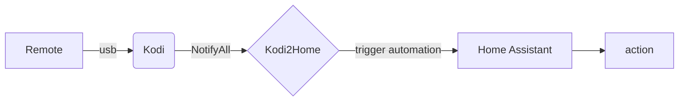

Kodi2home
=========
In home assistant you can connect to Kodi and control Kodi, but you cannot trigger an action when pressing a button on Kodi. This is where Kodi2home comes in to play. Kodi2home connects to the websocket from Kodi and to the websocket from home assistant. When it receives a "notifyall" from Kodi, it will trigger an automation on home assistant. In Kodi you change the keymap so that when you press a button it wil send the "notifyall" message. This whay you can turn on a light with the remote from Kodi. 

Note: When you change a button in the keymap of Kodi, it will override the existing function of that button. But you can control Kodi in your home assistant automation, and still do the same action. 

# Install

You Need the falowing thinks:
 - Home assitant
 - Kodi
 - A Usb remote connected to kodi
 - A whay to change the keymap on kodi <BR>
   (example: ssh in to libreelec)
   
Install kodi2home by going to Settings -> Addon's -> Add-on store -> Vertical ... (upperright) -> repositories -> fill in the url: `https://github.com/DJJo14/kodi2home`.
After a refresh the Kodi2home is now in you add-on store. click on it and press install. After installing you must configurate the add-on the configuration tab.
Example of the configuration:
```yaml
kodi_adress: youre kodi ip adress
kodi_http_port: 8080
kodi_ws_port: 9090
kodi_username: Youre username
kodi_password: Youre password
home_adress: 'ws://supervisor/core/api/websocket'
home_ssl: false
```

if you are using hassio you do not need to change the home_adress and home_ssl. The values are already set to the add-on values.

You need to change the keymap on kodi. [More info](https://kodi.wiki/view/HOW-TO:Modify_keymaps) There is a ¨Add-on:Keymap Editor" but you can not set it to send the NotifyAll message. So you need to change it in the keyboard.xml (or other .xml name)
put somting like this in your keymap of kodi:
```xml
<volume_up>NotifyAll("kodi2home", "kodi_call_home", {"trigger":"automation.volume_up"})</volume_up>
```
Add an automation on home assistant with the id/name: "volume_up".(you can leave automation triggers empty) Start up the kodi2home add-on and press the volume_up button. The automation will be triggerd on home assistant. Home assistant run you action that you put in you automation.

## Why
Home assitant can control kodi, but when you press a button on kodi you can not trigger a action on home assistant. Kodi2home is a man in the middel. I found this a missing feature of Home assistent. This way you can turn on a light with a kodi remote. Or change the volume on your amplifier instead of kodi. Or much smarter things.

## Why this way
With Kodi you can call scripts and with that do the same. Like calling a webtrigger. Because it has to start the script and then connect, it can be a sec later before the action is done.

## How is it done
Kodi2home is not more than two websockets connected to each other. One side is lisening for the "NotifyAll" and the other side sending it to Home Assistant. Both of the websockets are already connected.
It is done in a way Home Assistant uses kodi, so if it is liked, it can be intergated in to Home Assistant kodi intergration.

### Reload keymap
When you start the addon the keymap of kodi gets reloaded. So no need to restart all of kodi when changing the keymap(.xml), just restart the addon

## Known issue
For some reason Home Assistant disconnects when you fire to may, automations at ones. and it response to that with a disconnect, i do not know a better way to then to just reconnect. 

# example
In webos_example_automation.yaml there is a example of the automations that switches the remote between kodi(at the HDMI) and the webos apps. This way you can control the tv with one remote. For example a Measy GP811 or a RII usb wireless keyboard. In webos_example_keymap.xml is the kodi keymap to use with that.

Tip's, commands or spelling error's, just submit an issue
